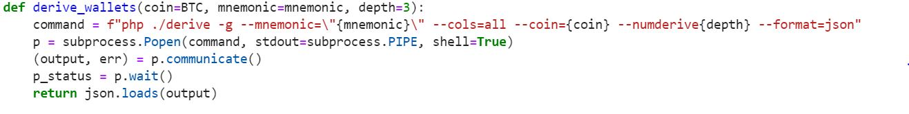
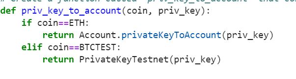
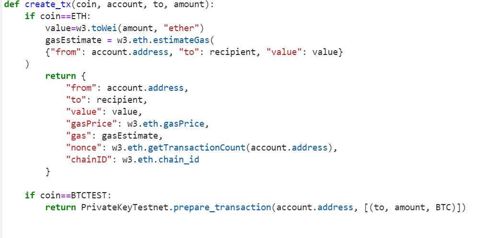
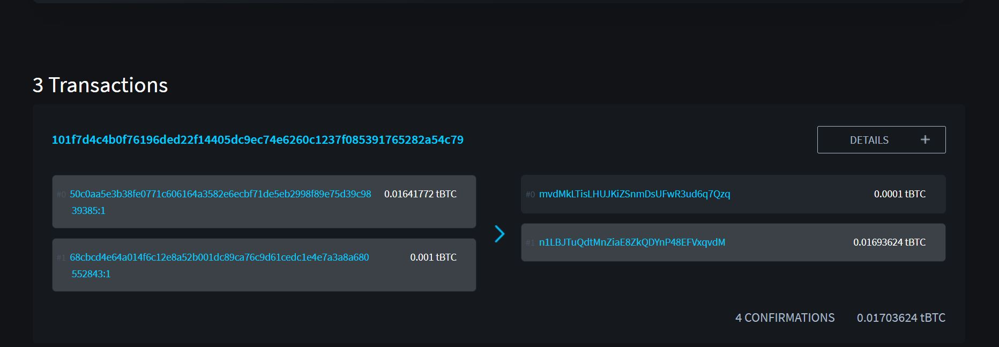

# Multi-Blockchain-Wallet-in-Python

Use HD Wallet to create a wallet to handle crypto assets. The hd-wallet-derive command line tool supports not only BIP32, BIP39, and BIP44, but also non-standard derivation paths for the most popular wallets out there today

## Dependencies
* HD Wallet Derive
* Blockchain TX 
* php 
* clone hd-wallet-derive tool
* bit Python Bitcoin library
* web3.py Python Ethereum library

## Procedure
Create a project directory called wallet and cd into it. Clone the `hd-wallet-derive` tool into this folder and install it using the [HD Wallet Derive Installation Guide](https://upenn.bootcampcontent.com/upenn-bootcamp/upenn-phi-virt-fin-pt-05-2021-u-c/-/blob/master/02-Homework/19-Blockchain-Python/Instructions/Resources/HD_Wallet_Derive_Install_Guide.md). Create a symlink called `derive` for the `hd-wallet-derive/hd-wallet-derive.php` script. This will clean up the command needed to run the script in our code, as we can call `./derive` instead of `./hd-wallet-derive/hd-wallet-derive.php`. Make sure you are in the top level project directory - in this case the directory named `wallet`.

Test that you can run the `./derive` script properly, by running the following command.  

     ```
      ./derive --key=xprv9zbB6Xchu2zRkf6jSEnH9vuy7tpBuq2njDRr9efSGBXSYr1QtN8QHRur28QLQvKRqFThCxopdS1UD61a5q6jGyuJPGLDV9XfYHQto72DAE8 --cols=path,address --coin=ZEC --numderive=3 -g
      ```
The output should match what you see below:
    
     ```
      +------+-------------------------------------+
      | path | address                             |
      +------+-------------------------------------+
      | m/0  | t1V1Qp41kbHn159hvVXZL5M1MmVDRe6EdpA |
      | m/1  | t1Tw6iqFY1g9dKeAqPDAncaUjha8cn9SZqX |
      | m/2  | t1VGTPzBSSYd27GF8p9rGKGdFuWekKRhug4 |
      +------+-------------------------------------+
      ```

Create a file called `wallet.py` -- this will be your universal wallet script. File available here [wallet](wallet/wallet.py) as a starting point.

In a separate file, `constants.py`, set the following constants:
  - `BTC = 'btc'`
  - `ETH = 'eth'`
  - `BTCTEST = 'btc-test'`

In `wallet.py`, import all constants: `from constants import *`. Then Generate a **new** 12 word mnemonic using `hd-wallet-derive` or by using [this tool](https://iancoleman.io/bip39/). Set this mnemonic as an environment variable by storing it a an `.env` file and importing it into your `wallet.py`.

Create a function called derive_wallets and create a dictionary object called coins that uses the derive_wallets function to derive ETH and BTCTEST wallets



Use bit and web3.py to leverage the keys stored in the coins object by creating three more functions:

priv_key_to_account that will convert the privkey string in a child key to an account object that bit or web3.py can use to transact.



create_tx that will create the raw, unsigned transaction that contains all metadata needed to transact.



send_tx that will call create_tx, sign the transaction, then send it to the designated network.


## Send Transactions
Open a Python shell and run the command from wallet import *. This will allow you to access the functions in wallet.py interactively.


## Transaction Confirmation
